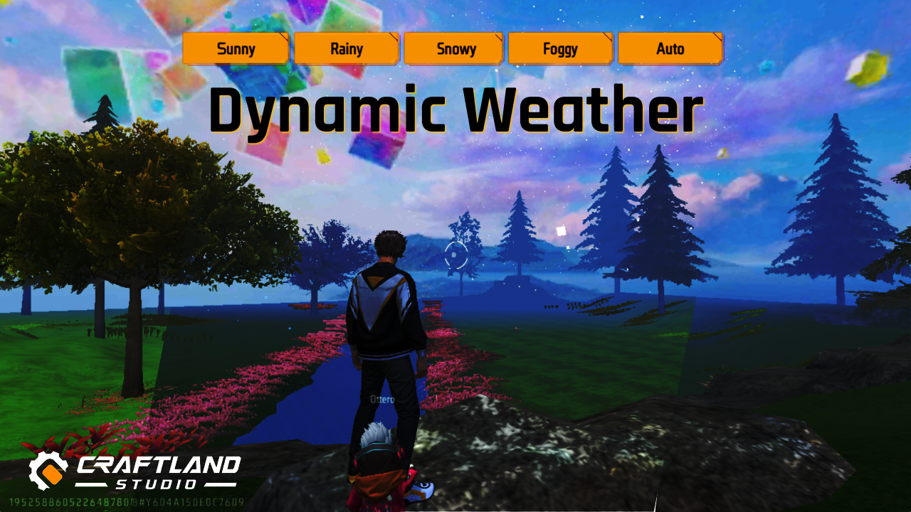
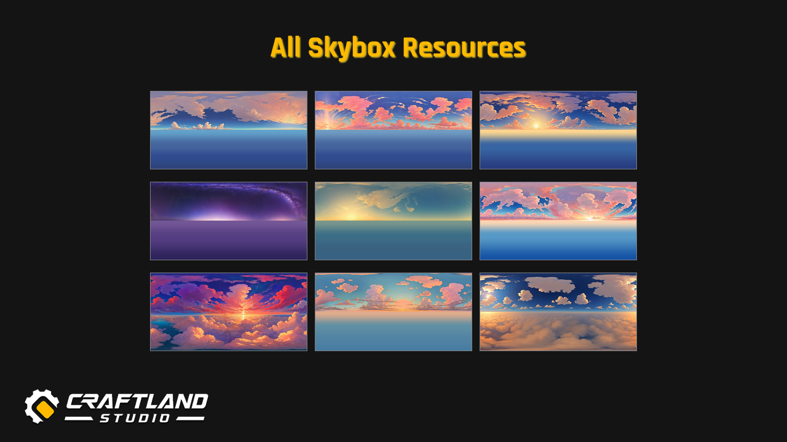

# Crafltand Studio Resources

> A collection of small but helpful resources for Craftland maps.

---

## 🌦 Dynamic Weather

---

## 🌌 All Skybox

---

## Voting System

<!--  -->

---

## 🔗 Useful Links

<!--   -->

---

## 🤝 Contributing

We ❤️ contributions! Follow these steps to contribute:

1. 🍴 **Fork** the repository
2. 🌿 **Create** a new branch (`git checkout -b feature/AmazingFeature`)
3. 💾 **Commit** your changes (`git commit -m 'Add some AmazingFeature'`)
4. 🚀 **Push** to the branch (`git push origin feature/AmazingFeature`)
5. 🔃 **Open a Pull Request**

📖 _See our [Contribution Guidelines](CONTRIBUTING.md) for more details._

---

## 📄 License

This project is licensed under the **CC0 1.0 Universal**. See the [LICENSE](LICENSE) file for details.

---

## 📬 Contact & Community

💬 Join us on **Discord**: [Click Here](https://discord.com/invite/xAQzPtS5m4)  
🐦 **Follow on Twitter**: [@nexoscrafting](https://twitter.com/nexoscrafting)  
📧 **Email**: [contact@nexoscrafting.live](mailto:contact@nexoscrafting.live)

  Created with ❤️ by <a href="https://github.com/nexoscrafting">@nexoscrafting</a>

  <a href="https://github.com/nexoscrafting/FE_RESOURCES_BETA/stargazers">⭐ Star us on GitHub!</a>

